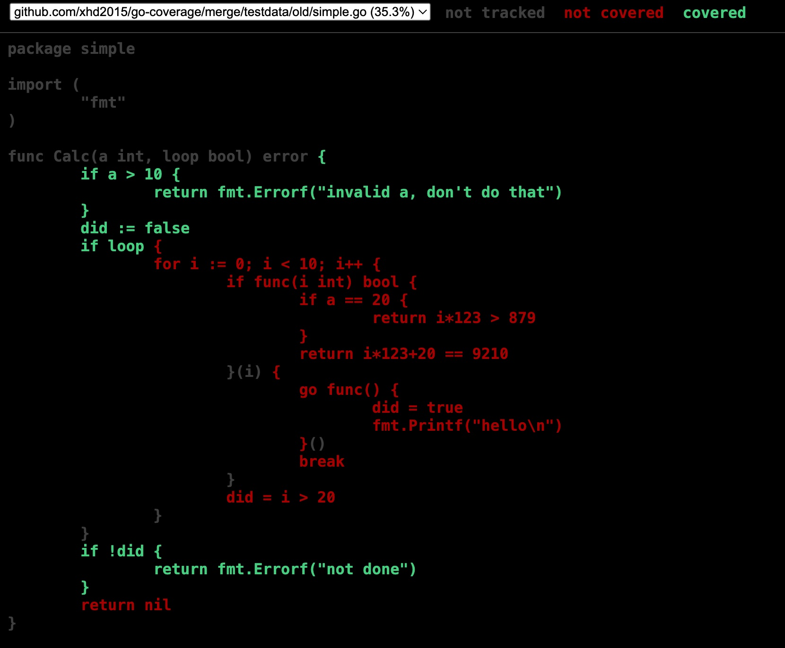

# Introduction

This library handles go-coverage files.
It provides semantic coverage profile merging function.
Check [merge/merge.go](merge/merge.go) for more details.

Example:

```bash
go test -run TestMergeProfile -v ./merge
```

Old Coverage:


New Coverage:


Merged Coverage:


# Algorithm

The algorithm implementation is at [merge/merge.go](merge/merge.go).

First, traverse the old and new AST tree to get each basic block's [cleaned code](./code/clean.go). Simply put, cleaned code is code that gets compiled into assembly, excluding any space and comments.

Then, use [myers diff](./diff/myers/diff.go) to find unchanged blocks, see [ComputeBlockMapping](./diff/myers/map.go).In this step we map all blocks in new AST to their unchanged counterpart in old AST.

Finally, use the new-to-old mapping to merge counters, for unchanged blocks, counters are added together.

The algorithm effectively provides incrimental testing coverage across muiltpe changes(e.g. multiple git commits).

# Diff

```bash
go generate ./...
```
